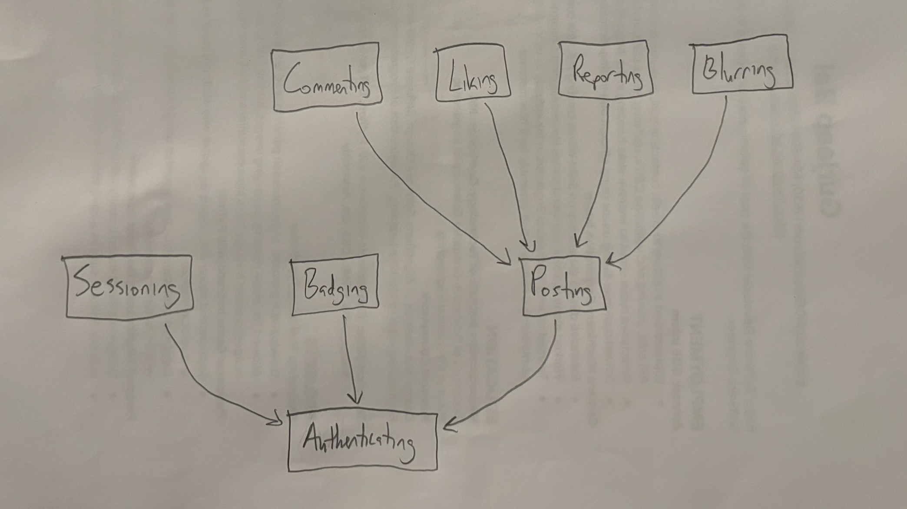

# Assignment 3: Convergent Design
27 September 2024

## Pitch
With the rapid growth of social media over recent years, worry and fear over safety on these apps is at an all-time high. This is especially true for children and young adults who are most likely to be affected by interactions on these apps. This brings about anxiety in both those young people and their parents or other adults that care about them. This app is designed to bring peace of mind to all of those people, and as such, it is aptly named SafeSpace. Some key functionality users of SafeSpace will notice is the very easily accessible “Report” button, on both posts and accounts. Users will never have to go searching for the report button. It has never been easier to bring inappropriate content to the attention of administrators. SafeSpace also gives users the ability to control blurring and its intensity on images. Other apps allow users to blur images, but there’s still no way to tell if the image is appropriate while it’s blurred. On SafeSpace, you can slowly reduce the blurring intensity to figure out if you really want to unblur it completely. SafeSpace also aims to disincentivize bad behavior through the novel idea of the Badge of Shame. When a report is successfully verified, the user who has been reported will have a Badge of Shame displayed on their account’s profile page. This badge also spreads to users who liked the reported post. However, we do provide users the ability to remove this badge through repeated good deeds on the app. This emphasizes improvement and creating a safe space here on SafeSpace.

## Concepts
### Posting [User]
- Purpose - users can post items for other users
- Operational Principle - after making a post, that post is available to other users unless it is deleted
- State
    - posts: set Post
    - user: posts → one User
- Actions
    - create (user: User, content: Image, out post: Post) - creates a post p and adds it to posts
    - delete (user: User, post: Post) - deletes a post p from posts if the user matches the user associated with p
    - getPosts (user: User, out uPosts: set Post) - returns all posts in posts made by user
### Commenting [Item, User]
- Purpose - users can comment in reply to other items
- Operational Principle - after making a comment on an item, when a user brings up that item, the comment is also included
- State
    - comments: set Comment
    - item: comments → one Item
    - content: one String
- Actions
    - create (user: User, item: Item, content: String, out comm: Comment) - creates a comment comm, consisting of content, associated to user and item and adds it to comments
    - getComments (item: Item, out comms: set Comment) - returns the comments associated to item in comments
### Authenticating
- Purpose - authenticate users so that app users correspond to people
- Operational Principle - after a user registers with a username and password pair, they can authenticate as that user by providing the pair
- State 
    - registered: set User
    - username, password: registered → one String
- Actions
    - register (name, pass: String, out user: User) - registers user u by adding u to registered
    - authenticate (name, pass: String, out user: User) - returns the associated user u from registered that matches the username and password provided
### Sessioning [User]
- Purpose - enable authenticated actions until the user is no longer logged in
- Operational Principle - after a session starts (and before it ends), the getUser action returns the user identified at the start
- State
    - active: set Session
    - user: active → one User
- Actions
    - start (user: User, out sess: Session) - adds a session s corresponding to user to active
    - getUser (sess: Session, out user: User) - returns the user that is associated to session sess in active
    - end (sess: Session) - removes session sess from active
### Liking [User, Item]
- Purpose - users can keep track of items that they like
- Operational Principle - after the user likes an item, they will be able to find it again in a list of liked items
- State
    - likes: set Like
    - user: likes → one User
- Actions
    - add (user: User, item: Item, out like: Like) - adds item i to likes after the user likes it
    - remove (user: User, like: Like) - removes item i from likes if the user matches the user associated with like
### Reporting [Item]
- Purpose - users can notify administrators about inappropriate content on the app
- Operational Principle - after the user reports an item, administrators will see that item and address it
- State
    - reports: set Report
    - verifiedReports: set Report
- Actions
    - create (item: Item, info: String, out report: Report) - creates a report using item and optional information info provided by an anonymous user and adds it to reports
    - verify (report: Report) - removes report from reports and adds it to verifiedReports
    - disprove (report: Report) - removes report from reports
### Blurring [User, Item]
- Purpose - users can choose to blur certain items
- Operational Principle - item x will be blurred, if x is in filter, such that the user can’t make out what it is until the user reduces the intensity
- State
    - filter: set Item
    - user: filter → one User
    - const standard: one Int
- Actions
    - system blur (item: Item, out blurItem: Item) - returns blurItem, a blurred version of item to the degree of a predefined standard if item is in filter
    - addFilter (user: User, filt: Item) - adds filt to the user’s filter 
    - removeFilter (user: User, filt: Item) - removes filt from the user’s filter
    - changeIntensity (item: Item, intensity: Int, out blurItem: Item) - returns blurItem, a blurred version of item to the degree of a user-defined intensity
### Badging [User]
- Purpose - users can have badges displayed on their profile
- Operational Principle - once earned, a badge will be displayed on the user’s profile until removed
- State
    - badges: set Badge
    - user: badges → one User
- Actions
    - give (user: User, badge: Badge) - gives badge to user
    - getBadges (user: User, out uBadges: set Badge) - returns uBadges, all the badges in badges associated to user
    - remove (user: User, badge: Badge) - removes user’s badge from badges

## Synchronizations
app SafeSpace

	include Authenticating
	include Sessioning [Authenticating.User]
	include Posting [Authenticating.User]
	include Commenting [Authenticating.User, Posting.Post]
	include Liking [Authenticating.User, Posting.Post]
	include Reporting [Posting.Post]
	include Blurring [Posting.Post]
	include Badging [Authenticating.User]

	sync register (username, password: String, out user: User)
		Authenticating.register (username, password)

	sync login (username, password: String, out user: User, out session: Session)
		user = Authenticating.authenticate (username, password)
		Sessioning.start (user)

	sync logout (session: Session)
		Sessioning.end (session)

	sync authenticate (session: Session, out user: User)
		Sessioning.getUser (session)

	sync post (session: Session, image: Image)
		user = Sessioning.getUser (session)
		Posting.create (user, image)

	system sync displayProfile (user: User, out profile: Profile)
		Posting.getPosts (user)
		Badging.getBadges (user)

	sync comment (session: Session, post: Post, content: String)
		user = Sessioning.getUser (session)
		Commenting.create (user, post, content)

	sync like (session: Session, post: Post, content: String)
		user = Sessioning.getUser (session)
		Liking.add (user, post)

	system sync blur (session: Session, post: Post, out blurredPost: Post)
		user = Sessioning.getUser (session)
		(post in Blurring.filter [user]) ? Blurring.blur (post) : post

	sync reduceBlur (post: Post, intensity: Int, out blurredPost: Post)
		Blurring.changeIntensity (post, intensity)

	sync report (post: Post, info: String, out rep: Report)
		Reporting.create (post, info)

	sync addressReport (report: Report)
		if (report == valid) {
            Reporting.verify (report)
            shame (report.User)
            spread (report.Post.Likes)
        } else Reporting.disprove (report)

	sync shame (user: User)
		Badging.give (user, shameBadge)

	sync spread (users: set User)
		Badging.give (user, shameBadge) for user in users

	sync recover (user: User)
		(user.goodDeeds > x) ? Badging.remove (user, shameBadge)

## Dependency Diagram

## Wireframe
https://www.figma.com/design/SObfUyVJn6yKpCPLdOFKlS/Untitled?node-id=0-1&t=TzlTdzkoRQk8gNHq-1

## Design Tradeoffs
- Report Button Placement - While wireframing and designing the UI, I had a few options on where to put the report button. Most apps have it hidden behind a menu on the post, so that was an option. The other option was having it right on the page next to the post. I went with having it right next to the post. Since the goal of SafeSpace is to create a safe environment for users, it made more sense to not have the report button hidden, but easily and quickly accessible for users at all times.
- Implementing Badge of Shame - While designing the badge of shame, there were multiple options on how to concept it. One was a concept specifically for the Badge of Shame-ing. Another was dividing it into Reporting and Badging. Finally, there was the option of not making a new concept at all. I went with dividing it into Reporting and Badging because it’s clear that there is some type of new behavior that we want here, so we can’t just not add anything. However, Badge of Shame-ing is way too specific and not reusable while Reporting and Badging are much more generic and can be combined in powerful ways to create a ton of functionality later.
- Report Menu Options - While wireframing the report menu, I had a decision to make with what options to display on the page. I could be very thorough and make a long list of options for users to read through and check appropriate boxes, or I could try to be concise and provide a limited number of options. I went with the concise route because I think users would be discouraged from filling out the form if there were too many options to read through. However, we still want users to be able to fully express their concerns, so I also provided a free response option if users wanted to use that instead.
