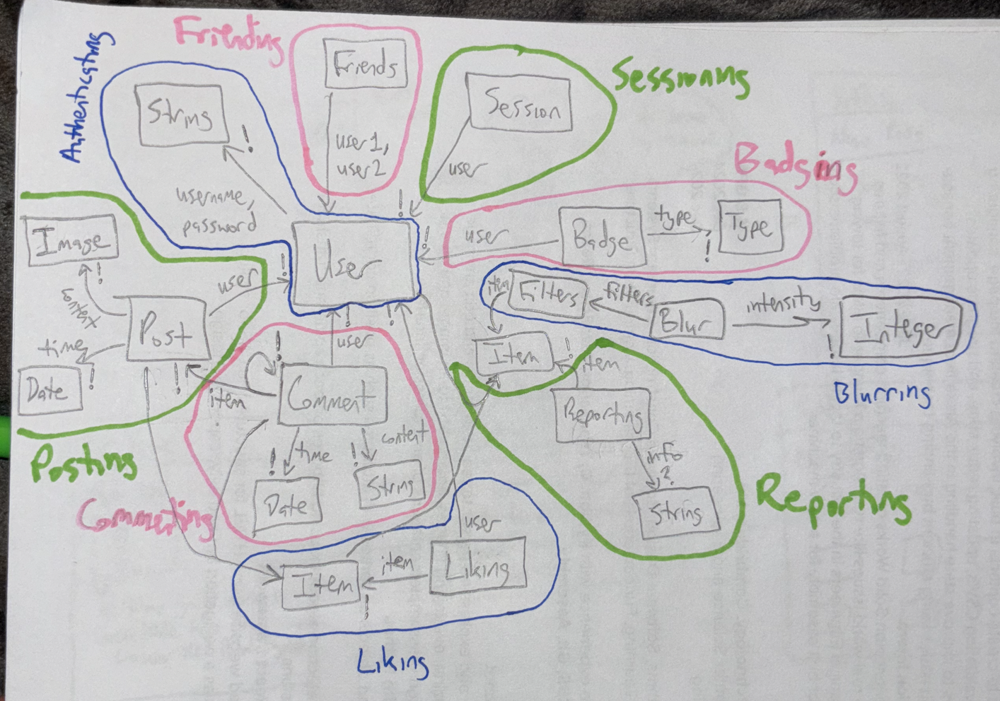

# Assignment 4: Backend Design and Implementation
3 October 2024

## Data Modeling
### Authenticating
- State 
    - registered: set User
    - username, password: registered → one String
### Sessioning [User]
- State
    - active: set Session
    - user: active → one User
### Posting [User]
- State
    - posts: set Post
    - user: posts → one User
    - content: posts → one Image
    - date: posts → one Date
### Friending [User]
- State
    - friends: set (User1, User2)
    - requests: User → set User
### Commenting [User, Item]
- State
    - comments: set Comment
    - user: comments → one User
    - item: comments → one Item
    - content: comments → one String
    - date: posts → one Date
### Liking [User, Item]
- State
    - likes: set Like
    - user: likes → one User
    - item: likes → one Item
### Reporting [Item]
- Purpose - users can notify administrators about inappropriate content on the app
- Operational Principle - after a user reports an item, and optionally provides additional information, administrators will see that item and address it
- State
    - reports: set Report
    - item: reports → one Item
    - info: reports → one String
- Actions
    - create (item: Item, info: String, out report: Report) - creates a report using item and optional information info provided by an anonymous user and adds it to reports
    - getReports (out uReports: set Report) - returns uReports, or all of the reports in reports state
    - address (report: Report, validity: Boolean) - removes report from reports and handles actions according to the value of validity
### Blurring [User, Item]
- Purpose - users can choose to blur certain items and change the blur intensity
- Operational Principle - item x will be blurred, if x is in filter, to a predefined degree until the user changes the intensity
- State
    - filters: User → set Item
    - intensity: filter → one Int
- Actions
    - system blur (item: Item, out blurItem: Item) - returns blurItem, a blurred version of item to the degree of a predefined standard if item is in filter
    - addFilter (user: User, filt: Item) - adds filt to user’s filters 
    - removeFilter (user: User, filt: Item) - removes filt from the user’s filters
    - changeIntensity (item: Item, intensity: Int, out blurItem: Item) - returns blurItem, a blurred version of item to the degree of a user-defined intensity
### Badging [User]
- Purpose - users can have badges displayed on their profile
- Operational Principle - once earned, a badge of the earned type will be displayed on the user’s profile until removed
- State
    - badges: User → set Badge
    - type: badges → one BadgeT
- Actions
    - give (user: User, type: BadgeT, out badge: Badge) - gives badge of type type to user
    - getBadges (user: User, out uBadges: set Badge) - returns uBadges, all the badges in badges associated to user
    - remove (user: User, badge: Badge) - removes user’s badge from badges

## App Definition
app SafeSpace

	include Authenticating
	include Sessioning [Authenticating.User]
	include Posting [Authenticating.User]
	include Commenting [Authenticating.User, Posting.Post]
	include Liking [Authenticating.User, Posting.Post]
	include Friending [Authenticating.User]
	include Reporting [Posting.Post]
	include Blurring [Authenticating.User, Posting.Post]
	include Badging [Authenticating.User]

## Abstract Data Diagram

## Backend Code Repo
https://github.com/gjaap21/safespace-backend

## Deployed Service
https://safespace-backend.vercel.app
